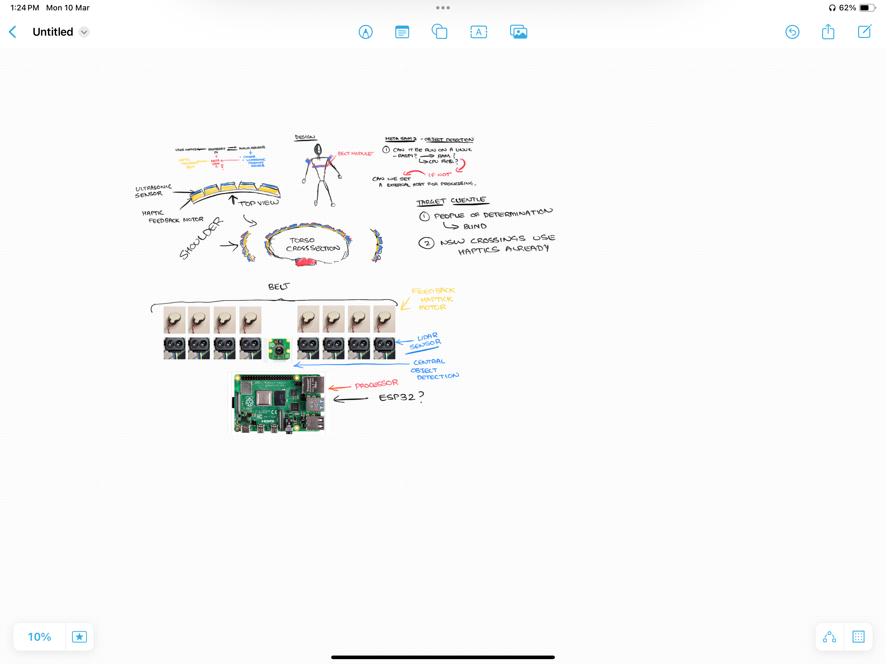

# elec-5518

Note - we wound up discussing the Lidar / Haptic Assistive Object detection
for vision impaired concept with lecturer, as was most complete proposal

Will move forward with that for now

# Chosen Project

## (Neil) Lidar / Haptic Assistive Object detection for vision impaired

- Neil to write up description
- Lidar / Range sensors around person

### Tasks

- T1: Investigate cost effective sensors
  - Look at radars (cheap)
  - Lidar sensors
  - Laser sensor
  - Camera (plural?)
  - We need to understand their capabilities
    - Are they linear sensors, or is the crossover in their segments
    - If there's crossover, do we compose this somehow
- T2: Look @ Market / competition
- T3: Define MVP
  - Value adds
- T4: Understand level of processing:
  - processing requirements
  - real time capability

### Notes/challenges:

- ML Models to process lidar output (potentially?)
- Processing to compose multiple inputs
  - as POC, can look at just haptic alerting
- Do we need ML at all & if so, what model?
  - ML handles confusing signals / noisy signals
  - Object recognition
- Look at cameras / cost effective cameras

Potentially use hotspot if internet connectivity needed

# Other projects

Discussed in brief

## (Ophelia) Self Driving Car

- Reacts to changing road conditions to modulate speed
  - Maybe reduces speed below limit if wet conditions
  - Can use image recognition for this
    - Meets requirements for "things"
      - Sensor
      - processing (non trivial)
      - actuation
  - Maybe uses map API to set speed limit?
    - Meets a requirement for "internet" though IMO (matt) might not be worth effort

## (Matt) Bare metal server cluster autoscaler + management + monitioring platform

- Use low power gateway server to scale up / down worker server based on incoming traffic
- monitor power usage using IoT sensors (smart plugs, etc)
- dashboards / alerting based on thermals, power usage
- spin up case fans based on thermals